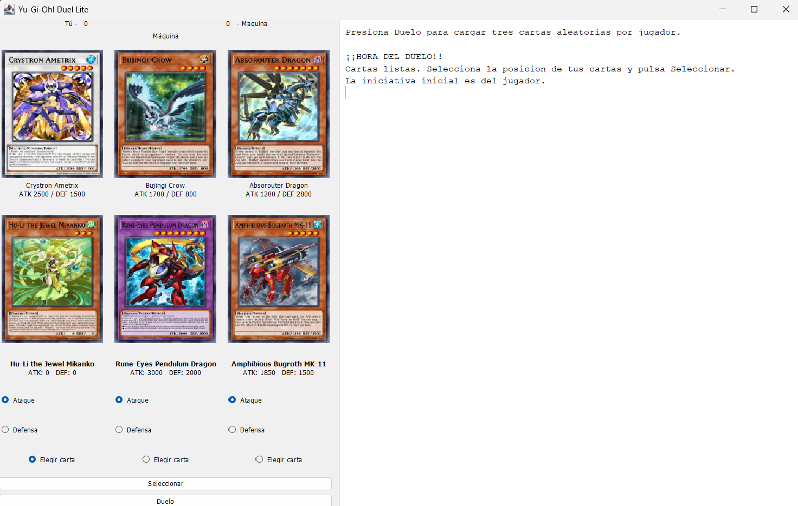
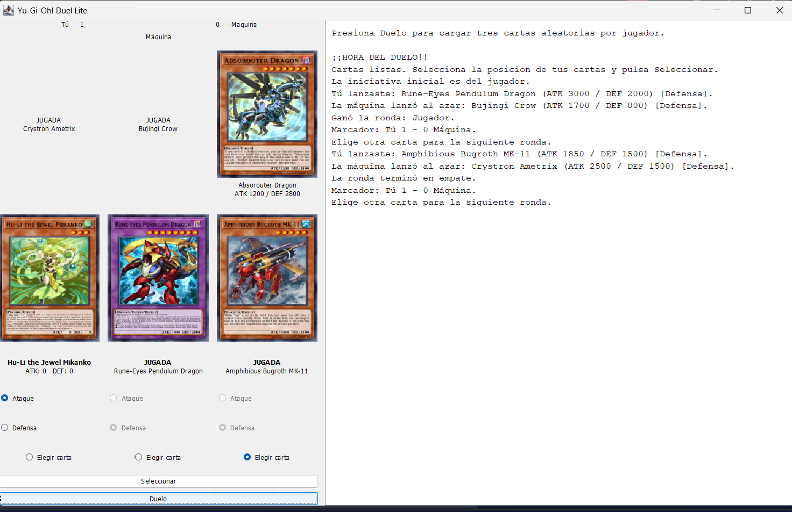
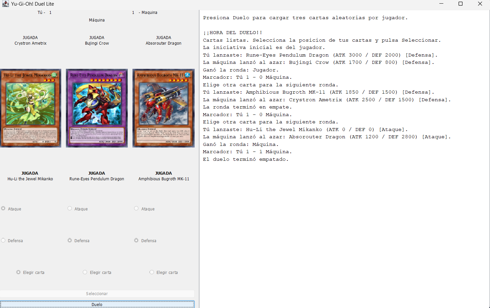

# Yu-Gi-Oh! Duel Lite

Aplicación de escritorio en Java Swing para practicar el consumo de una API REST. Obtiene seis cartas Monster de YGOProDeck, muestra sus imágenes y atributos, y permite jugar contra la máquina.

## Requisitos

- Java 11 o superior.
- Maven 3.8 o superior (para descargar `org.json` y ejecutar el proyecto).
- Conexión a Internet para cargar cartas e imágenes.

## Ejecutar en IntelliJ IDEA

1. Abre la carpeta del proyecto en IntelliJ.
2. Si IntelliJ pregunta, selecciona **Load Maven Project**.
3. Espera a que Maven descargue la dependencia `org.json`.
4. Abre `src/Main.java` y ejecuta `main`. La ventana usa el diseño vinculado en `src/YgoApiClient.form`.

Para resolver la librería JSON desde una terminal, ejecuta:

```bash
mvn clean compile
```

## Cómo jugar

1. Presiona **Duelo** y espera a que aparezcan las tres cartas aleatorias de cada lado.
2. Marca el radio button bajo la carta que quieras lanzar y elige **Ataque** o **Defensa** para esa carta.
3. Presiona **Seleccionar**. La máquina escoge una carta aleatoria y su posición; el juego compara los valores correspondientes de ATK y DEF.
4. El primero en ganar dos rondas gana el duelo. El panel derecho registra las jugadas y el marcador.

Si falla la conexión, el mensaje de estado indica que no fue posible cargar las cartas. Puedes presionar **Iniciar duelo** otra vez para reintentar.

## Diseño

`Card` guarda los datos de una carta. `YgoApiClient` construye la interfaz, consulta la API y escucha los eventos del duelo. `Duel` mantiene las manos y aplica las reglas de cada ronda. `BattleListener` es una interfaz que separa los cambios de la partida de lo que Swing muestra en pantalla.

La solicitud HTTP usa `HttpClient.sendAsync`, por eso la ventana no queda bloqueada mientras se descargan las cartas. El JSON se lee con `org.json`. Las imágenes se descargan en tareas de fondo y se actualizan en Swing mediante `SwingUtilities.invokeLater`. Los nombres de los campos Java coinciden con los bindings del formulario IntelliJ.

## Capturas




